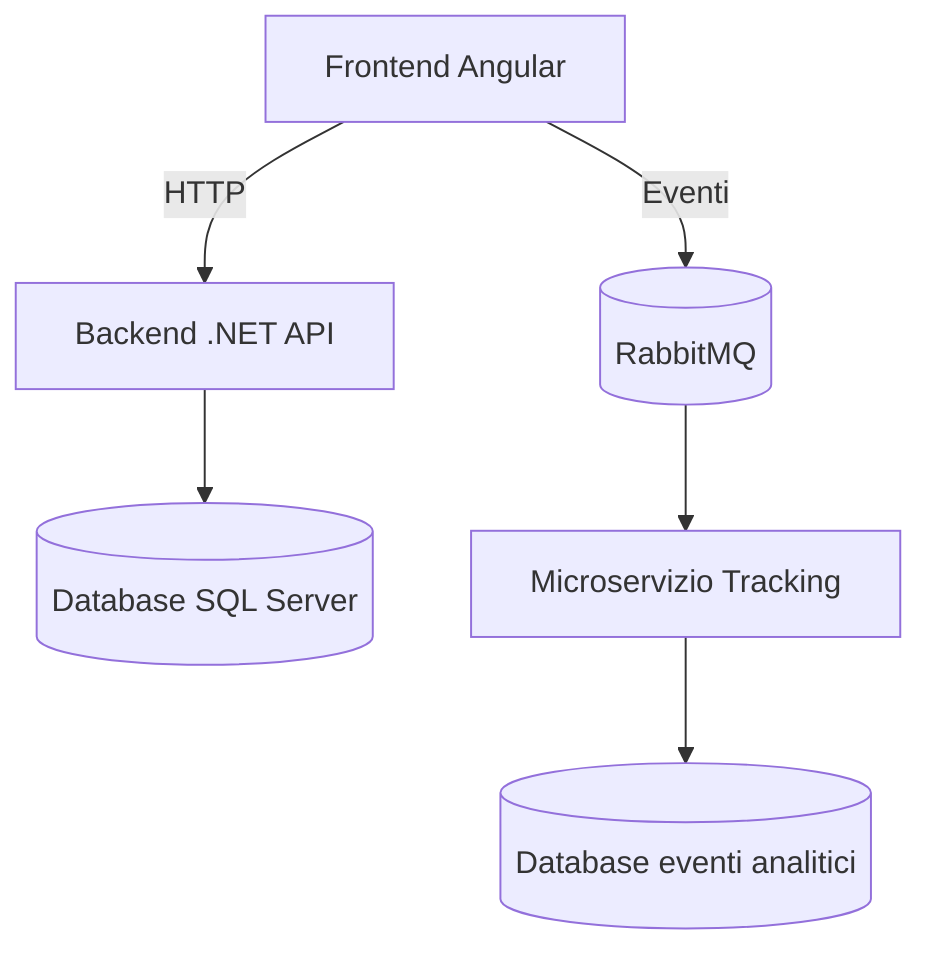

# 🧱 Architettura del Progetto – Love&Cooking

## 🔍 Panoramica

Il progetto è composto da tre macro-componenti:

1. **Frontend Angular** – gestione utente e admin, interfaccia responsive
2. **Backend ASP.NET Core** – logica applicativa e gestione dati
3. **Microservizio Tracking** – sistema separato per il tracciamento eventi e sessioni utente

---

## 📁 Struttura delle cartelle

```
Root/
├── Backend/
│ └── CucinaMammaAPI/ → API REST con Entity Framework Core
├── Front-end/
│ └── sito-cucina-mamma/ → App Angular 19
└── Microservizio/
└── TrackingService/ → Microservizio .NET Worker per eventi
```

---

## 🔄 Flusso dati



### 🧱 Dettagli tecnici

-🔧 Backend API

- Progetto ASP.NET Core 8
- Database SQL Server con Entity Framework
- Controller REST per ogni entità: categorie, ricette, immagini, ecc.
- Supporto upload immagini + metadati SEO
- Autenticazione e ruoli

### 💻 Frontend Angular

- Angular 19
- Routing avanzato (pubblico + admin)
- Reactive Forms con validazioni custom
- Upload immagini e drag & drop ordinabile
- Ottimizzazione SEO e performance (Google PageSpeed)

### 📊 Microservizio Tracking

- Progetto .NET Worker
- Consuma eventi da RabbitMQ
- Salva eventi in database separato (dimensioni, fatti, funnel)
- EtlHostedService per elaborazione batch e reporting funnel

### 🔐 Sicurezza e ottimizzazione

- Protezione API con CORS e header sicuri
- Logging eventi e tracciamento attività
- Campi SEO configurabili: slug, seoTitle, seoDescription
- Immagini con metadati obbligatori (alt, title, caption)
- Ordinamento immagini con drag & drop + ordine persistente

### 📈 Obiettivi futuri

- Area blog, commenti e utenti registrati
- E-commerce per prodotti digitali (ricettari PDF, video corsi)
- Integrazione Mautic per email marketing e automation
- Dashboard analytics avanzata
